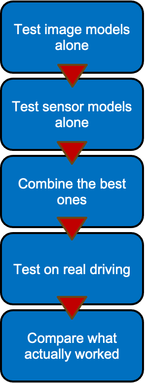
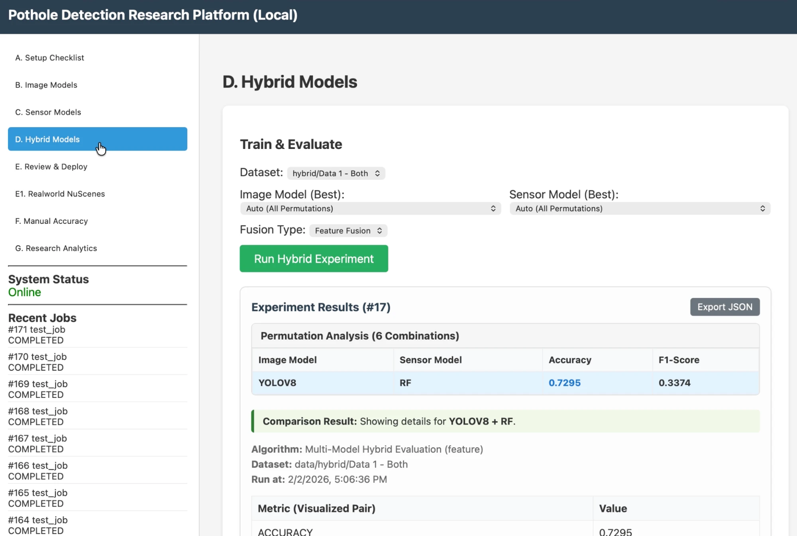
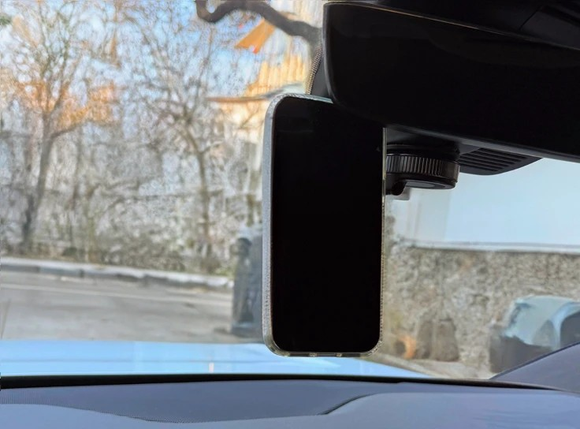
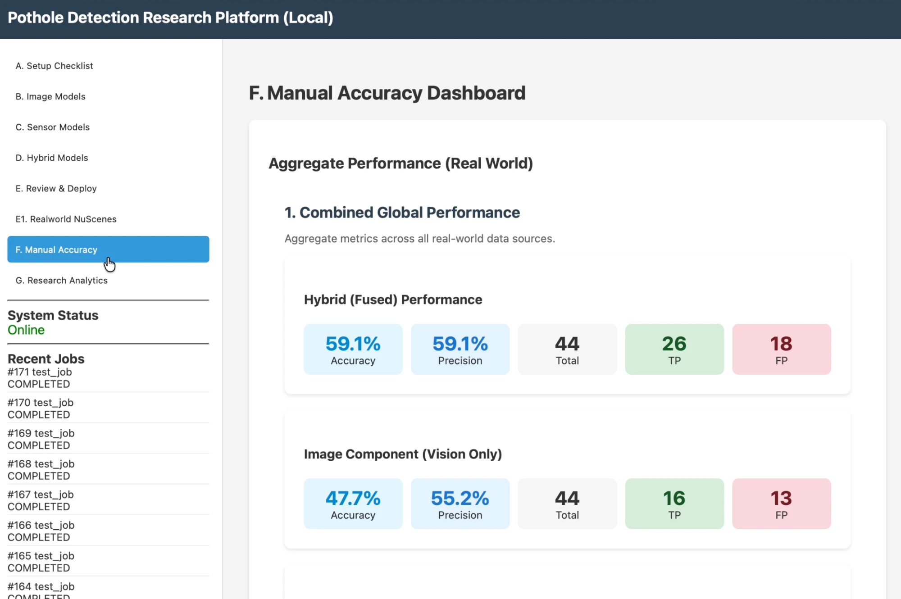

# How I Built This (and What Went Wrong)

I'm a middle school student who is into cars and self-driving
technology. This page is the honest story of the project: what I built,
the mistakes I found, and what I learned. I'm including the mistakes on
purpose. Finding and fixing them was most of the real work.

A note on tools: I used AI coding assistants throughout — the same way
professional engineers do — for writing code, hunting bugs, and editing
documents. What I couldn't delegate was deciding what to test, what
counts as a pothole, what to do when results looked wrong, recording
the drives, and labeling every clip myself (twice). This project was
accepted to GARSEF, the Austin regional science fair, in 2026.

## The plan

*The benchmark actually tested every camera-and-sensor combination (54
of them) and picked the winner using validation data only — that keeps
the comparison fair.*

## The idea

Potholes wreck wheels and cost cities millions. Self-driving cars are
already starting to track them (Waymo shares pothole data with Waze).
My question: if one phone in one car can detect potholes with its camera
*and* its motion sensor, does combining them beat either one alone? And
does that still hold on real roads, not just in a lab?

## Phase 1: Build the system

*The hybrid training panel — it tries every camera + sensor pairing.
(Numbers in this screenshot are from an early demo run; the citable
results are in [RESULTS.md](RESULTS.md).)*

I built a web platform that can:
- train camera models (YOLOv8, Faster R-CNN, U-Net, ResNet18),
- train motion-sensor models (Random Forest, 1D-CNN, BiLSTM),
- fuse them into hybrid models two different ways,
- run any model on a real drive video + sensor recording,
- and show detected events as video clips a human can review.

## Phase 2: Find out my data was lying to me

This was the biggest lesson of the project. My main sensor dataset
labeled **every** road problem as a pothole — cracks, joints, spalls,
everything. So my early models weren't detecting potholes at all. They
were detecting "any vibration," and the accuracy numbers looked amazing
and meant nothing.

Fixing this took a full audit:
- Relabeled 663 files so only actual potholes count as positive
  (with a manifest file recording every change, so it can be checked).
- Made one shared labeling rulebook in code, so every model uses the
  exact same definition of "pothole."
- Froze the train/validation/test splits into files, so no model can
  accidentally test on data it trained on.
- Removed every place where the code made up a number when something
  failed (like fake charts when a calculation crashed). Now it reports
  "missing" instead of guessing. A wrong number is worse than no number.

After cleaning, the task got much harder — and much more real. Accuracy
that was "100%" before became F1 scores around 0.6. Those are the
numbers I trust and publish.

## Phase 3: The 94-test benchmark

I wrote a script that runs the entire comparison automatically: every
model, every dataset, plus simple baselines that every model has to
beat. It ran overnight. Some things it caught:

- My LSTM model was fake — a config bug made it secretly train the CNN
  instead. I implemented a real BiLSTM.
- Models were being picked by accuracy, which on unbalanced data picks
  the model that says "no pothole" to everything. I switched selection
  to F1, and a model that scored 0.0 jumped to 0.345.
- Two image datasets let models cheat by recognizing which camera took
  the photo. I documented that instead of reporting fake perfect scores.

Result: hybrid fusion won, F1 0.622 vs 0.605 for the best single
sensor. A small, honest win.

## Phase 4: The real world fights back

*The recording rig: an iPhone mounted at the windshield, capturing
video and motion-sensor data at the same time.*

I recorded six real drives with my iPhone (video + motion data), froze
the winning models, and ran them on the recordings. I built a blinded
review page that showed me each detection clip with no hints, mixed in
random "probe" clips to catch missed potholes, and labeled 266 clips —
twice, to measure my own consistency.

The result was humbling. Precision fell to about 0.10. The camera model
found zero real potholes — it was trained on close-up pothole photos
and went blind on dashcam video. And the hybrid advantage disappeared,
because fusing a good sensor with a blind camera just adds noise. I
even tested "only trust hybrid when the camera sees at least a little
something" — it made the results *worse*.

I wrote all of this up as the finding, because it is one:
**a hybrid system is only as strong as its weakest sensor in the real
world.** Knowing that tells you exactly what to fix next.

*An early review dashboard from before the blinded protocol. Its numbers
came from reviews where I could see the model scores — one of the
reasons I rebuilt the review process to be blinded. The published
real-world numbers come from the blinded 266-clip study.*

## What I learned

1. **Check your labels before trusting any result.** My biggest bug was
   in the data, not the code.
2. **Make cheating impossible, including for yourself.** Frozen splits,
   blinded review, pre-registered plans. The boring discipline is what
   makes the numbers believable.
3. **Baselines keep you honest.** If your fancy model can't beat "react
   to big shakes," it didn't learn anything.
4. **Negative results are results.** The real-world failure is the most
   useful thing this project produced.
5. **Lab wins are the start, not the end.** The gap between a benchmark
   and an actual car is the whole game in automotive tech.

## What's next

- Train an image model on real dashcam footage (RDD2022-style data) and
  re-run the transfer test. That is the experiment this project says
  matters most.
- Calibrate the sensor model so it stops firing on every rough patch.
- Long-term: a comma.ai dashcam add-on, and a shared city pothole
  database fed by every AV company's cars — open-source, not locked
  inside one company.
