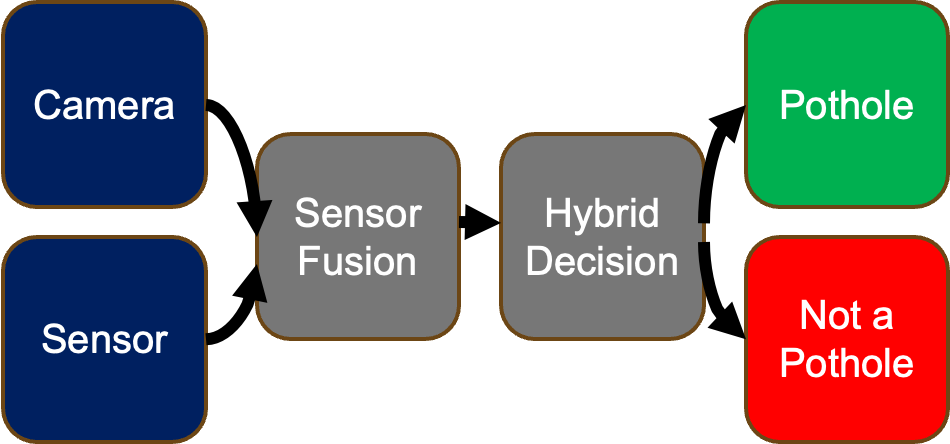
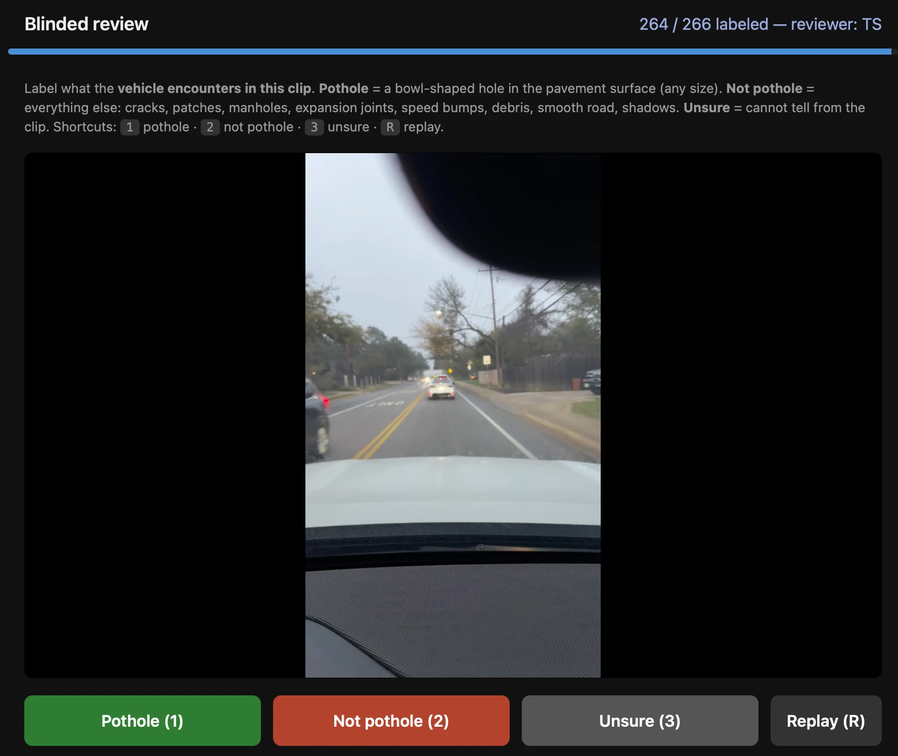

# Pothole Detection Lab 🚗

**Multi-modal pothole detection — camera, motion sensor, and hybrid fusion — with a pre-registered, blinded real-world transfer study.**

By **Warren Stading** ([@warstad11](https://github.com/warstad11)) · Austin, Texas · Accepted to GARSEF (Austin regional science fair), 2026

**Can a car detect potholes better with a camera, a motion sensor, or both
at once?** I built this project to find out.

I am a middle school student who loves cars and self-driving technology.
Potholes damage cars, cost cities millions of dollars, and are a real
problem self-driving companies like Waymo are starting to track. I wanted
to build something real: a full system that trains pothole detectors,
tests them fairly, and then checks if they still work in the real world.

This repo is the whole system. You can run it yourself, swap in your own
data, and repeat my experiments.

## What it does



The system detects potholes three ways:

| Method | How it works | Models |
|---|---|---|
| **Camera** | Looks at road pictures and finds potholes | YOLOv8, Faster R-CNN, U-Net, ResNet18 |
| **Motion sensor** | Feels the bumps with a phone's accelerometer | Random Forest, 1D-CNN, BiLSTM |
| **Hybrid (both)** | Combines what the camera sees with what the sensor feels | Feature fusion, Late fusion |

One important rule makes this harder (and more honest) than most pothole
projects: **only real potholes count as positive**. Cracks, speed bumps,
manhole covers, and rough patches all count as "not a pothole." A model
that just detects "rough road" fails here. That is the point.

## What I found

**In the lab, hybrid wins — but only a little.** I ran 94 benchmark tests
with fair train/test splits. The best hybrid model (YOLOv8 + Random
Forest fused together) scored F1 0.622. The best single-sensor model
scored 0.605. ([Full results](results/benchmarks/SUMMARY.md))

**In the real world, everything got much harder.** I drove real roads
with an iPhone recording video and motion data, ran the frozen models on
those drives, and hand-labeled 266 detection clips without knowing which
model made each one (a "blinded" review). Precision dropped to about
0.10 for every model, and the hybrid advantage disappeared completely.
The camera model basically went blind on dashcam footage.
([Full analysis](results/transfer/FINDINGS.md))

That second result is a negative finding, and I kept it. Real science
means reporting what actually happened. The big lesson:
**combining two sensors is not a free win — the combination is only as
strong as its weakest sensor in the real world.**

A short, plain-language version of all results is in
[RESULTS.md](RESULTS.md). The story of building this (including the bugs
I found and fixed) is in [PROJECT_STORY.md](PROJECT_STORY.md).

## Quick start

```bash
git clone <this-repo>
cd <this-repo>
python3 -m venv .venv
source .venv/bin/activate
pip install -r requirements.txt
brew install ffmpeg        # Mac (Linux: sudo apt install ffmpeg)

# Start the web dashboard
python -m uvicorn main:app
# open http://localhost:8000

# In a second terminal, start the background worker
source .venv/bin/activate
python worker.py
```

Full setup help (including where to get data) is in
[docs/GETTING_STARTED.md](docs/GETTING_STARTED.md).

## Try it without training anything

The repo ships the **pre-trained winner models**
([models/pretrained/](models/pretrained/), ~13 MB): the YOLOv8 camera
model, the Random Forest sensor model, and the fusion network that
combines them. Record a drive with your phone (see the data guide),
drop it in `data/iphone/`, and run:

```bash
python tools/run_transfer.py     # detect potholes with the frozen models
# then label what it found at http://localhost:8000/transfer
```

Fair warning: these models are a **baseline to beat**, not a finished
product — see the real-world results below.

## My own dataset

I'm releasing my real iPhone drives as a dataset others can use — the
accelerometer/gyroscope streams plus 232 human-labeled video clips. See
[dataset/README.md](dataset/README.md). The sensor data is privacy-scrubbed
(GPS, timestamps, device IDs, and street names all removed); the video clips
are auto-blurred for faces, plates, and signs (imperfect — see the dataset's
privacy note and terms). The scrub is reproducible:
`tools/build_release_dataset.py` + `tools/blur_clips.py`.

## Get the data (for training/benchmarks)

The full training datasets are too big for GitHub. Run the setup assistant — it
checks what you have, downloads what it can, and gives exact
instructions for the rest:

```bash
python tools/download_data.py                  # status + instructions
python tools/download_data.py --roboflow KEY   # auto-fetch a pothole
                                               # image set (free API key)
```

Details and file formats: [docs/DATA_GUIDE.md](docs/DATA_GUIDE.md). The
fastest path is still **recording your own drive** with the free Sensor
Logger phone app and any camera.

## Repeat my experiments

```bash
# The 94-test benchmark (camera vs sensor vs hybrid, ~8 hours)
python tools/run_benchmarks.py            # add --smoke for a quick test

# The real-world transfer experiment
python tools/run_transfer.py              # score your drives
# then open http://localhost:8000/transfer to label clips (blinded)
# then GET /api/transfer/metrics for your scores
```

Both experiments write their results as tables you can read directly.



*The blinded review page. It shows only the clip — no scores and no hint
of which model flagged it — so the labels can't be biased.*

## For students

Ideas you can explore with this repo:

- **Beat my image model.** Mine was trained on close-up pothole photos
  and failed on dashcam video. Train one on dashcam-style data (look up
  the RDD2022 road damage dataset) and see if hybrid finally wins in the
  real world.
- **Try your own car or bike.** Record a drive with Sensor Logger.
  Does the sensor model transfer to your vehicle?
- **Make fusion smarter.** Can a fusion model learn to ignore a sensor
  when that sensor is confused?
- **Tune the thresholds.** My models fired way too often on real roads.
  Can you fix that without losing real potholes?

## Where this is going

Two things I want to build on top of this:

1. **A plugin for [comma.ai](https://comma.ai) openpilot dashcams**, so
   regular drivers can map potholes with hardware they already own.
2. **A civic push for shared AV pothole data.** My own results are the
   argument: a model trained on one vehicle's camera and suspension
   does not transfer to another vehicle. That means no single company's
   potholes-as-seen-by-our-cars data solves the problem — cities should
   ask **every** self-driving fleet to feed one shared, open pothole
   database (Waymo already shares some pothole data with Waze; that
   idea, but for everyone). I'm drafting an open letter to the cities
   of Austin, Phoenix, and San Francisco making this case.

## Documentation map

| Doc | Level | What's inside |
|---|---|---|
| [RESULTS.md](RESULTS.md) | Easy | All results in plain language |
| [PROJECT_STORY.md](PROJECT_STORY.md) | Easy | How I built it, what went wrong, what I learned |
| [docs/GETTING_STARTED.md](docs/GETTING_STARTED.md) | Easy | Setup, server, experiments, step by step |
| [docs/DATA_GUIDE.md](docs/DATA_GUIDE.md) | Easy | Where to get data and exact file formats |
| [docs/METHODOLOGY.md](docs/METHODOLOGY.md) | Advanced | The full scientific protocol (splits, leakage controls, metrics) |
| [docs/ARCHITECTURE.md](docs/ARCHITECTURE.md) | Advanced | How the code is organized and why |
| [docs/DATASETS.md](docs/DATASETS.md) | Advanced | Every dataset, every label rule |
| [docs/TRANSFER_PROTOCOL.md](docs/TRANSFER_PROTOCOL.md) | Advanced | The pre-registered real-world experiment plan |
| [dataset/README.md](dataset/README.md) | Easy | My iPhone drives, privacy-scrubbed (sensor + labeled clips) |
| [models/pretrained/](models/pretrained/) | Easy | Ready-to-run trained models (~13 MB) |
| [results/benchmarks/SUMMARY.md](results/benchmarks/SUMMARY.md) | Medium | The 94-test benchmark tables |
| [results/transfer/FINDINGS.md](results/transfer/FINDINGS.md) | Medium | The real-world transfer analysis (starts with a plain-English summary) |

## Science fair

This project was accepted to **GARSEF (the Austin regional science
fair), 2026**.

## Acknowledgments

- **AI assistance**: I used AI coding tools (Claude) heavily during this
  project — for writing and reviewing code, finding bugs, and editing
  these documents. The research questions, design decisions, drive
  recordings, all 500+ hand labels, and the conclusions are my own work.
  I believe in being upfront about this: it's how modern engineers
  work, and the judgment calls are the part that can't be delegated.
- **Datasets**: Pothole-600 (Rui Fan et al.), Roboflow Universe pothole
  datasets, the nuScenes dataset (Motional), and public road-anomaly
  sensor collections. Each has its own license — see
  [docs/DATA_GUIDE.md](docs/DATA_GUIDE.md).
- **Open-source tools**: PyTorch, Ultralytics YOLOv8, scikit-learn,
  FastAPI, and ffmpeg.

## How to cite this work

If you use this code, the models, the dataset, or the findings, please cite:

> Stading, Warren (2026). *Pothole Detection Lab: camera, sensor, and hybrid
> pothole detection with a real-world transfer study.*
> https://github.com/warstad11/pothole

BibTeX:

```bibtex
@software{stading2026pothole,
  author  = {Stading, Warren},
  title   = {Pothole Detection Lab: camera, sensor, and hybrid pothole
             detection with a real-world transfer study},
  year    = {2026},
  url     = {https://github.com/warstad11/pothole}
}
```

## License

MIT — use it, learn from it, build on it. See [LICENSE](LICENSE).

**Datasets are licensed separately.** The third-party datasets this project
trains on (Pothole-600, Roboflow exports, nuScenes, etc.) each carry their
own license and terms — check them before redistributing any data. The
drives I recorded and released myself are covered by
[dataset/TERMS.md](dataset/TERMS.md).
