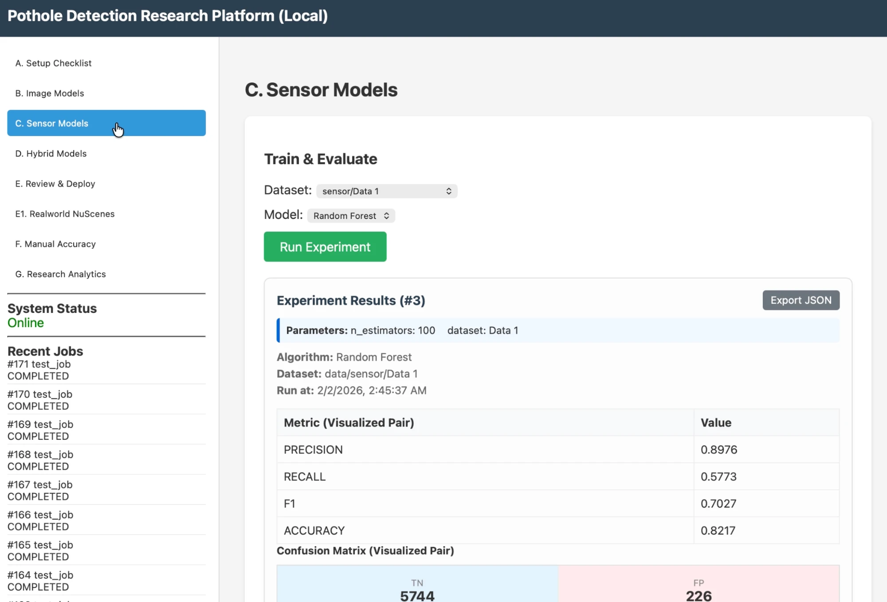
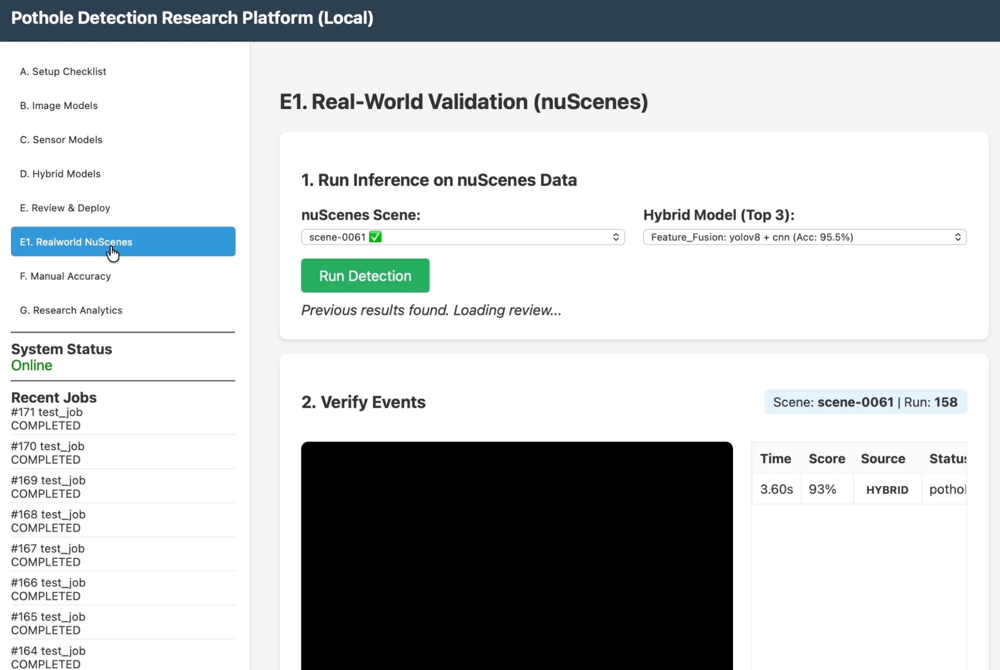

# Data Guide

The datasets are too large for GitHub, so this guide shows you (1) where
to find data like mine, (2) the exact folder and file formats the code
expects, and (3) the fastest path: recording your own drive. If your
files match the formats below, every experiment in this repo will run on
your data.

For the exact label rules and the full history of how I cleaned my
datasets, see [DATASETS.md](DATASETS.md) (advanced).

---

## The fast path: record your own drive

You need a phone and 30 minutes.


1. Install the free **Sensor Logger** app (iOS or Android).
2. Mount the phone in a car (a dashboard mount is ideal).
3. Start recording in Sensor Logger (make sure Accelerometer,
   Gyroscope, and Location are on), and start a video recording —
   the phone's own camera or any dashcam.
4. Drive a route with some potholes if you can find them.
5. Export the Sensor Logger session and drop everything into a folder:

```
data/iphone/MyDrive-2026-06-15/
├── Accelerometer.csv     (from Sensor Logger)
├── Gyroscope.csv         (from Sensor Logger)
├── Location.csv          (from Sensor Logger)
└── Camera/
    └── drive.mp4         (your video)
```

That's it. The code converts this automatically into a processed
`sensor.csv` (resampled to 100 Hz) the first time you use the session.
Then run `python tools/run_transfer.py` and label your detections at
`http://localhost:8000/transfer`.

One thing to watch: start the video and the sensor recording at close
to the same moment. The system lines them up using a time offset file
(`alignment.json`) that defaults to zero offset.

---

## Sensor training data

**Format:** one CSV file per "pass" over a road feature, in one folder:

```
data/sensor/MySensorData/
├── Pothole_001.csv
├── FatigueCrack_001.csv
├── Undamaged_001.csv
└── ...
```

Each CSV needs these columns:

```
label, accel_x, accel_y, accel_z, gyro_x, gyro_y, gyro_z, seconds_elapsed
```

- `label` is the same value in every row of a file: **1 only if the file
  is a real pothole pass, 0 for everything else** (cracks, bumps,
  joints, smooth road). This rule is the heart of the project.
- Accelerometer in m/s², 100 Hz sampling (or close — the code windows
  at 100 samples per second).



*Once your folder matches this format, it appears in the sensor training
panel. (Numbers in this screenshot are from an early demo run.)*

**Where to find data like mine:** search for public road-anomaly
accelerometer datasets — collections of labeled accelerometer passes
over potholes, cracks, and other road defects. Two of mine came from
public research datasets of exactly this kind. **Warning from
experience:** check the labels before training. My main dataset shipped
with every anomaly labeled as a pothole, and I had to relabel 663 files
(the relabeling tool is included: `tools/relabel_sensor_data.py`).

---

## Image training data

**Format:** standard YOLO layout — the format almost every detection
dataset exports to:

```
data/image/MyImageData/
├── data.yaml                 (lists the class name: pothole)
├── train/
│   ├── images/  *.jpg
│   └── labels/  *.txt        (one line per pothole box; empty file = no potholes)
├── valid/
│   ├── images/
│   └── labels/
└── test/
    ├── images/
    └── labels/
```

**Where to find it:**
- **Roboflow Universe** (free account) has many pothole detection
  datasets. Export any of them in "YOLOv8" format and you get exactly
  the layout above. That is where my `Pothole.v1` set came from.
- **Pothole-600** is a research dataset by Rui Fan and colleagues with
  real pixel-level pothole masks (search "Pothole-600 dataset"). I used
  it for the U-Net segmentation benchmark. Its layout:

```
data/image/Pothole600_Segmentation/
├── train/  rgb/  label/      (240 images + masks)
├── valid/  rgb/  label/      (180)
└── test/   rgb/  label/      (180)
```

**A trap I hit, so you can avoid it:** if your pothole photos and your
"plain road" photos come from different cameras or websites, models can
cheat by recognizing the camera style instead of the pothole. The most
trustworthy datasets have positives and negatives from the same source.
My benchmark flags this automatically when scores look too perfect.

---

## Hybrid (paired) data

Hybrid training needs image + sensor recordings of the **same moment**,
paired by filename:

```
data/hybrid/MyHybridData/
├── dataset_index.json        (filename → label map; the source of truth)
├── images/
│   ├── 42_Pothole_7.jpg
│   └── ...
└── sensor/
    ├── 42_Pothole_7.csv      (same name = same moment)
    └── ...
```

The matching filename stems are what pairs them. My paired set came
from extracting frames + sensor windows out of real drive sessions
(1,002 pairs). You can build your own the same way from a Sensor Logger
drive: a frame from the video plus the sensor window at that timestamp,
sharing a filename.

---

## nuScenes (self-driving car data)

nuScenes is a large public dataset from real autonomous test cars
(Boston and Singapore). Get it at **nuscenes.org** (free for research;
the small "mini" split is enough). This repo expects per-scene folders:

```
data/nuscenes/scene-0061/
├── frames_cam_front/         *.jpg, named by microsecond timestamp
└── imu/
    └── ms_imu.csv            utime, ax, ay, az, gx, gy, gz, qw, qx, qy, qz
```

The code builds the video and the 100 Hz sensor file automatically from
these. (I used 10 scenes; the front camera frames and the IMU stream
are the only parts needed.)



*Running detection on a nuScenes scene from the dashboard. (Model labels
visible in the dropdown are from early demo models.)*

---

## Checklist before training

1. Folder matches one of the layouts above.
2. Labels follow the rule: **1 = real pothole only**.
3. Run the dataset validator from the dashboard (Setup panel) — it
   checks layouts and label formats and tells you what's wrong.
4. The first training job on a dataset freezes its train/valid/test
   split into a `split_manifest.json` file next to the data. That is on
   purpose: every model must use the same split, or the comparison is
   unfair. Delete that file only if you want to re-roll the split (it
   invalidates all previous results on that dataset).
