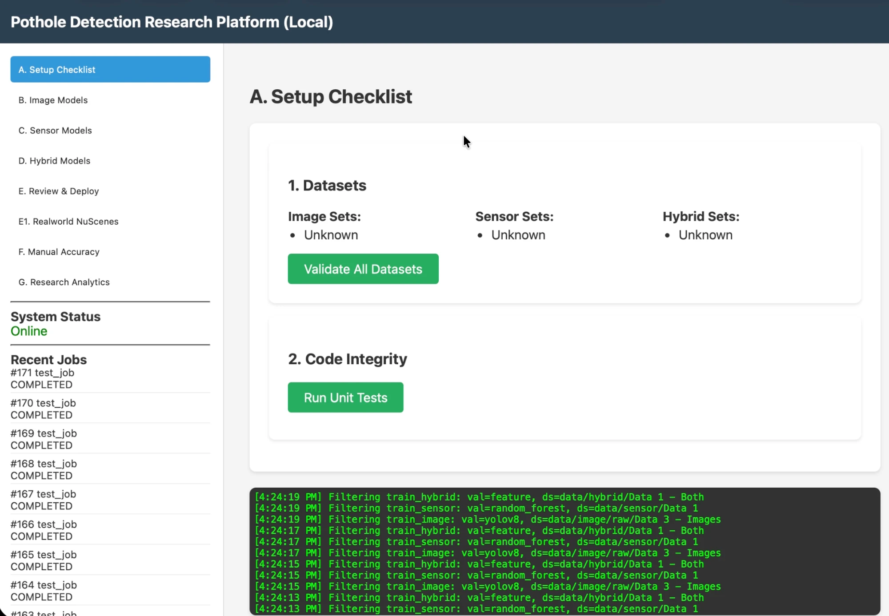
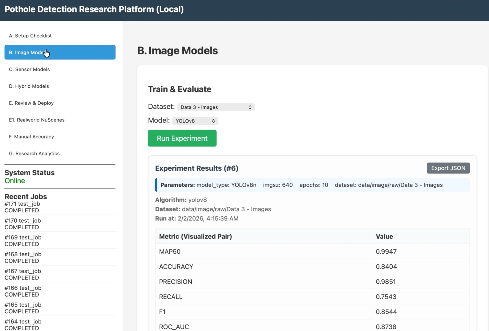
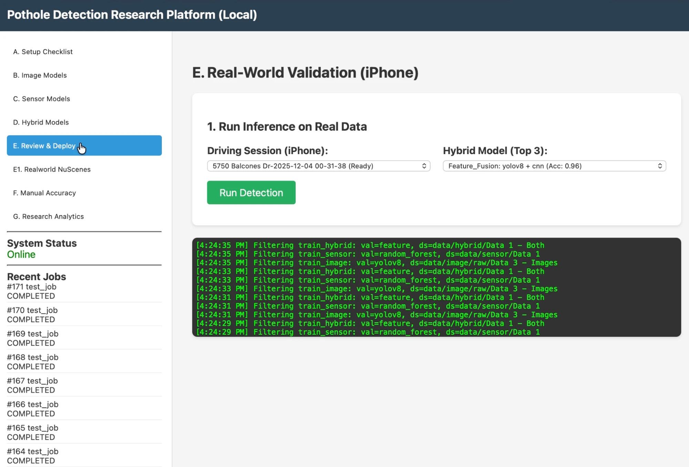

# Getting Started

This guide takes you from zero to running experiments. No machine
learning experience needed for the setup part.

## 1. What you need

- A computer with Python 3.10 or newer (Mac, Linux, or Windows with WSL).
  A Mac with Apple Silicon is great — the code uses its GPU
  automatically where it helps.
- About 10 GB of free disk space if you download the full datasets.
- `ffmpeg` (a free video tool) for cutting event clips.

## 2. Install

```bash
git clone <this-repo>
cd <this-repo>

python3 -m venv .venv
source .venv/bin/activate
pip install -r requirements.txt

# ffmpeg:
brew install ffmpeg          # Mac
sudo apt install ffmpeg      # Ubuntu/Debian Linux
```

## 3. Get some data

Run the setup assistant first — it checks what you have and tells you
exactly how to get what's missing:

```bash
python tools/download_data.py
# with a free Roboflow API key it can fetch an image dataset for you:
python tools/download_data.py --roboflow YOUR_KEY
```

See [DATA_GUIDE.md](DATA_GUIDE.md) for formats. You have two paths:

- **Fast path:** record your own drive with the free Sensor Logger phone
  app and a camera (about 30 minutes), then run the pre-trained models
  from [models/pretrained/](../models/pretrained/) — no training needed.
- **Full path:** download the public datasets to repeat my benchmark.

## 4. Start the platform

The platform is two programs that run at the same time, in two
terminals:

```bash
# Terminal 1 — the web dashboard
source .venv/bin/activate
python -m uvicorn main:app
# now open http://localhost:8000 in your browser

# Terminal 2 — the worker (it does the actual training)
source .venv/bin/activate
export PYTHONPATH=$PYTHONPATH:.
python worker.py
```

The dashboard is where you validate datasets, start training jobs, and
review detection clips. The worker picks up each job and runs it.



*The dashboard's setup panel: validate your datasets and run the unit
tests before training anything.*

## 5. Run the experiments

**Quick smoke test (about 20 minutes).** This runs the full benchmark
pipeline with tiny training budgets, just to prove your setup works:

```bash
python tools/run_benchmarks.py --smoke
```

**The full benchmark (about 8 hours — run it overnight):**

```bash
python tools/run_benchmarks.py
```

You can also train single models from the dashboard panels:



*Training panels for image, sensor, and hybrid models. (The numbers in
this screenshot are from an early demo run — the citable results live in
[results/benchmarks/SUMMARY.md](../results/benchmarks/SUMMARY.md).)*

Tips:
- On a laptop, stop it from sleeping:
  `caffeinate -dims python tools/run_benchmarks.py` (Mac).
- If it gets interrupted, just run it again. It resumes where it
  stopped and never repeats finished tests.
- Results appear as tables in `results/benchmarks/results.md` and
  update after every single test.

**The real-world transfer experiment:**



*Running the frozen models on a real iPhone drive. (Numbers visible in
UI dropdowns are from early demo models.)*

```bash
# 1. Put your drives in data/iphone/ (see DATA_GUIDE.md)
# 2. Score them with the frozen models:
python tools/run_transfer.py

# 3. If you got more clips than you want to label,
#    sample a manageable subset (do this BEFORE labeling):
python tools/sample_review.py --events 200 --probes 60

# 4. Label clips in your browser (blinded — no hints shown):
#    open http://localhost:8000/transfer
#    keys: 1 = pothole, 2 = not pothole, 3 = unsure, R = replay

# 5. Get your scores:
#    open http://localhost:8000/api/transfer/metrics
#    or run: python tools/transfer_metrics.py
# Tables land in results/transfer/metrics.md
```

## 6. Where things live

| Folder | What's in it |
|---|---|
| `app/services/models/` | All the model code (image, sensor, hybrid) |
| `app/services/labels.py` | The one shared rulebook for what counts as a pothole |
| `app/services/splits.py` | Frozen train/validation/test splits |
| `tools/run_benchmarks.py` | The 94-test benchmark |
| `tools/run_transfer.py` | The real-world experiment |
| `results/` | Every result table this project produced |
| `docs/` | Deeper documentation |

## 7. Common problems

- **"YOLO requires data.yaml"** — your image dataset folder is missing
  its `data.yaml` file. See the format in [DATA_GUIDE.md](DATA_GUIDE.md).
- **Training is slow on Mac** — the code already picks the right chip
  (GPU or CPU) per model. Faster R-CNN is just slow on laptops; its
  budget is small for that reason.
- **The server died while labeling** — your labels are safe. Every
  label is saved the moment you click. Restart the server and the
  review page picks up where you left off.
- **A test crashed mid-benchmark** — rerun the script. Crashed tests
  retry automatically; finished ones are skipped.
